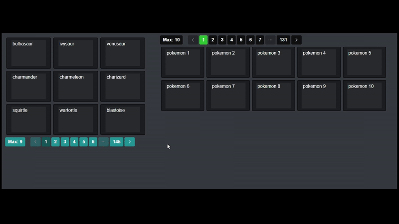

# Uzna Paginator (2020)

This is a small custom pagination library i wrote back in 2020 when i was working on a learning app for course students.
It needs to be polished a little bit, but it's pretty useful.

## Demo


## How to use

1. Include the CSS and JS:
```html
<link rel="stylesheet" href="paginator.css">
<script src="paginator.js"></script>
```

2. Set up the simple html structure
```html
<div id="main-paginator-container" style="width: 500px;">	
    
    <!-- data renders here -->
    <div class="paginator-data">
    </div>

    <!-- menu here or wherever you wish (as long as it's inside #main-paginator-container) -->
    <div class="paginator-menu">
    </div>
    
</div>
```

3. Initialize Pagination instance
```js
let testPagination = new Pagination({
    container: '#main-paginator-container',
  generateUrl: function(){
    return `https://pokeapi.co/api/v2/pokemon?limit=${this.max}&offset=${this.page * this.max - this.max}`;
  },
  requestMethod: 'GET',
  total: 1302, // number of pokemons according to this api
  max: 9,
    maxOptions: [3,9,12,15,18], // optional
  extractResponseData: function(response){
    return response.results;
  },
  renderData: function(data){ // customize however you need
    let final_html = '';
    data.forEach(function(item){
      final_html += `<div class="loaded-item">
        <div class="loaded-item-content">
          ${item.name}
        </div>
      </div>`;
    });
    return final_html;
  }
});
```


4. Additional parameters (optional)
```js
let testPagination = new Pagination({
  container: '#main-paginator-container',
  generateUrl: function(){
    return `https://pokeapi.co/api/v2/pokemon?limit=${this.max}&offset=${this.page * this.max - this.max}`;
  },
  requestMethod: 'GET',
  total: 1302,
  max: 10,
    maxOptions: [5, 10, 15, 20, 40],
  spaceLimit: 9, // pagination buttons limit
  initial_data: [ // data you already have on the page load, otherwise the class will make request to api on page 1 to load initial data.
    {id: 1, name: 'pokemon 1'}, {id: 2, name: 'pokemon 2'}, {id: 3, name: 'pokemon 3'}, 
    {id: 4, name: 'pokemon 4'}, {id: 5, name: 'pokemon 5'}, {id: 6, name: 'pokemon 6'}, 
    {id: 7, name: 'pokemon 7'}, {id: 8, name: 'pokemon 8'}, {id: 9, name: 'pokemon 9'}, {id: 9, name: 'pokemon 10'}
  ],
  extractResponseData: function(response){
    return response.results;
  },
  renderData: function(data){
    let final_html = '';
    data.forEach(function(item){
      final_html += `<div class="loaded-item">
        <div class="loaded-item-content">
          ${item.name}
        </div>
      </div>`;
    });
    return final_html;
  },
  drawSkeleton: function(){ // custom skeleton loader
    let final_html = '';
    for (let i = this.max - 1; i >= 0; i--) {
      final_html += `<div class="loaded-item">
        <div class="skeleton-loader">
        </div>
      </div>`;
    }
    return final_html;
  },
  buttonColors:{
    background: '#101010',
    hover: '#232323',
    active: 'limegreen'
  }
});
```